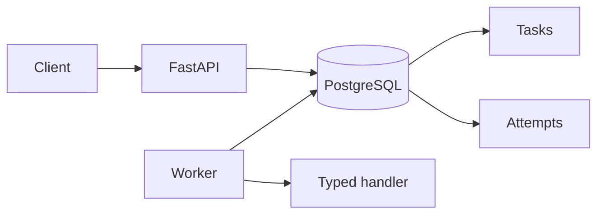

# NinjaTech Deployment Lab

[](https://github.com/amirss/ninjatech-deployment-lab/actions/workflows/ci.yml)
[](https://www.python.org/downloads/)
[](LICENSE)

A production-oriented execution substrate for approved, long-running enterprise work.
It demonstrates the part of an agent system that must remain reliable when a process
crashes, a client retries, ownership changes, or a handler returns late.

The current release implements the execution control plane. It does **not** yet implement
an LLM, a real Jira/GitHub/Slack integration, authentication, tenancy, or cloud deployment.
Those boundaries are deliberate and visible so that implemented evidence is not confused
with proposed architecture.

> **Independent engineering project.** This repository is a portfolio lab built around a
> realistic enterprise ticket-to-PR workflow. It is not an official NinjaTech product.

Maintained by [Amir Seyedi](https://www.linkedin.com/in/amirseyedi).

## What is implemented

| Capability | Implementation evidence | Verification evidence |
| --- | --- | --- |
| Idempotent task creation | PostgreSQL uniqueness and atomic conflict insert | API, persistence, and concurrent-create tests |
| Explicit approvals and cancellation | Centralized state transitions with row locking | Transition matrix and concurrent approve/cancel tests |
| Durable worker execution | Separate worker with `FOR UPDATE SKIP LOCKED` claims | Multi-worker PostgreSQL tests |
| Crash recovery | Leases, heartbeats, immutable attempts, and expiry recovery | Lease-expiry and recovery tests |
| Stale-worker protection | Attempt number plus hashed execution-token fencing | Wrong-token and late-return tests |
| Bounded failure handling | Retry budgets, equal-jitter backoff, timeouts, and terminal reasons | Unit and live PostgreSQL tests |
| Delivery discipline | Explicit Alembic migrations, non-root containers, structured logs | CI migration round trip and container smoke workflow |

The repository is intentionally strongest on failure behavior, not feature count. See the
[failure semantics](docs/wiki/Failure-Semantics.md) and
[engineering decisions](docs/DECISIONS.md) for the trade-offs and the conditions that would
justify changing them.

## Run the proof

The fastest end-to-end check is:

```bash
cp .env.example .env
# Replace the placeholder database password in .env.
make demo
```

The demo builds the image, verifies a non-root runtime, starts PostgreSQL, applies
migrations explicitly, starts the API and worker, and proves:

1. normal task success;
2. retry followed by success;
3. durable cooperative cancellation;
4. liveness remaining healthy while readiness fails after PostgreSQL is stopped.

It exits non-zero on any unmet claim and removes its containers, network, and volumes. The
full walkthrough and expected evidence are in [docs/DEMO.md](docs/DEMO.md).

For code-level verification:

```bash
make install
make check
```

CI runs the same format, lint, strict-type, migration, unit, PostgreSQL, concurrency, and
container checks on every pull request and push to `main`.

## System shape



- The **API** creates, retrieves, approves, and cancels tasks.
- **PostgreSQL** owns idempotency, lifecycle state, scheduling, leases, and attempt history.
- A **worker** claims one eligible task in a short transaction and executes outside it.
- A **typed handler** receives cooperative cancellation signals but no database session.

PostgreSQL is the only queue and coordination system at this scale. Adding Redis, Celery,
Kafka, or SQS would increase the operating surface without improving the guarantees this
bounded workload currently needs. The revisit conditions are documented rather than
treated as permanent doctrine.

## Reliability model

Execution is **at least once**.

A claim transaction:

1. selects one due task with `FOR UPDATE SKIP LOCKED`;
2. changes it to `running`;
3. assigns an attempt number and unguessable execution token;
4. stores only the token hash;
5. creates the durable attempt record;
6. commits before calling the handler.

Heartbeats and finalization must match the task, worker, attempt number, and token hash.
After lease recovery, an old worker can no longer mutate either the task or attempt—even if
its handler later returns success.

This protects internal state. It cannot undo an external side effect already accepted by
another provider. Real integrations therefore require a separate business-scoped action
identity and reconciliation process. That work is a proposed next milestone, not a current
claim; see [enterprise integration design](docs/wiki/Enterprise-Integration-Design.md).

## API surface

| Endpoint | Purpose |
| --- | --- |
| `GET /health` | Process liveness; never calls PostgreSQL |
| `GET /ready` | Bounded PostgreSQL readiness check; fails closed |
| `POST /tasks` | Create an idempotent `pending_approval` task |
| `GET /tasks/{task_id}` | Read the public-safe task state |
| `POST /tasks/{task_id}/approve` | Approve eligible work |
| `POST /tasks/{task_id}/cancel` | Cancel queued work or request cooperative running cancellation |

`POST /tasks` requires an `Idempotency-Key`. Reusing the key with the same canonical request
replays the original task; reusing it with different content returns `409`.

Task responses exclude the idempotency key, request fingerprint, worker identity, lease
material, stack traces, database errors, and unsafe exception text.

## Local development

Prerequisites:

- Python 3.12 or newer;
- [`uv`](https://docs.astral.sh/uv/);
- Docker with Docker Compose for PostgreSQL and the end-to-end proof.

Run the API directly:

```bash
cp .env.example .env
# Use localhost rather than db in NINJATECH_DATABASE_URL for a host-run API.
make install
make migrate
make run
```

Run the complete container stack:

```bash
docker compose up --build
docker compose run --rm app alembic upgrade head
```

Migrations are a separate deployment action. API and worker startup never mutate schema.

The deterministic `diagnostic` handler exists only to verify execution behavior. It is
disabled by default and configuration rejects enabling it in staging or production.

## Boundaries

The default branch is an execution-control lab, not a production SaaS:

- no authentication or tenant isolation;
- no production task handler;
- no LLM or agent framework;
- no real external-provider credentials or calls;
- no user interface;
- no cloud infrastructure or operating history;
- no claim of exactly-once behavior across independent systems.

These are release boundaries, not hidden caveats. The
[evidence-gated roadmap](docs/wiki/Roadmap.md) describes what must be demonstrated before
the scope expands.

## Development method

This project is developed with AI coding assistance under repository-scoped engineering
rules. Generated output is treated as untrusted until its diff is reviewed and it passes
formatting, strict typing, failure-oriented tests, and CI. The maintainer remains accountable
for the architecture, release boundary, and published claims.

The repository does not use line count or generated prose as evidence. Executable checks,
explicit limitations, and recorded decision/revisit conditions are the evidence.

## Documentation

- [Seven-minute evidence walkthrough](docs/DEMO.md)
- [Architecture overview](docs/wiki/Architecture-Overview.md)
- [Reliable worker execution](docs/wiki/Reliable-Worker-Execution.md)
- [Failure semantics](docs/wiki/Failure-Semantics.md)
- [Engineering decisions and revisit conditions](docs/DECISIONS.md)
- [Proposed enterprise integration design](docs/wiki/Enterprise-Integration-Design.md)
- [Customer delivery walkthrough](docs/wiki/FDE-Walkthrough.md)
- [Evidence-gated roadmap](docs/wiki/Roadmap.md)
- [Public wiki](https://github.com/amirss/ninjatech-deployment-lab/wiki)

## Author

Built and maintained by [Amir Seyedi](https://www.linkedin.com/in/amirseyedi), a technical
founder working at the intersection of agentic AI, enterprise workflows, and regulated
decision systems.

## License

[MIT](LICENSE)
