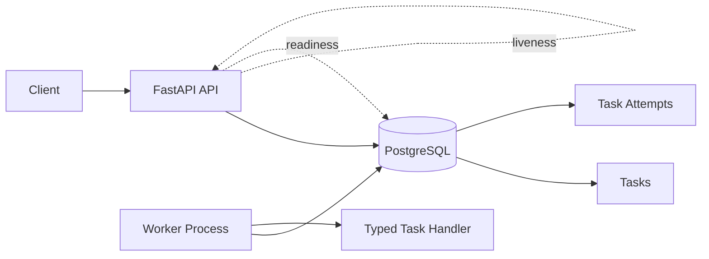
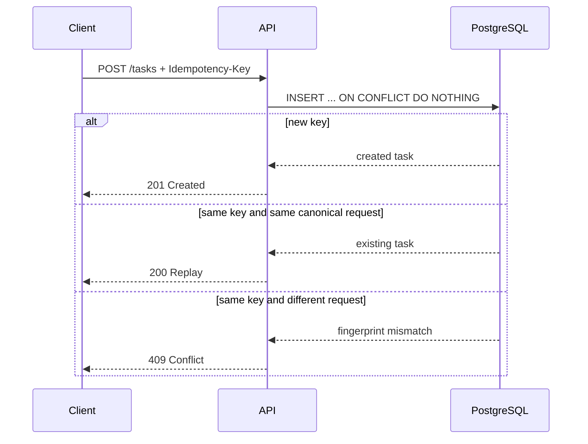
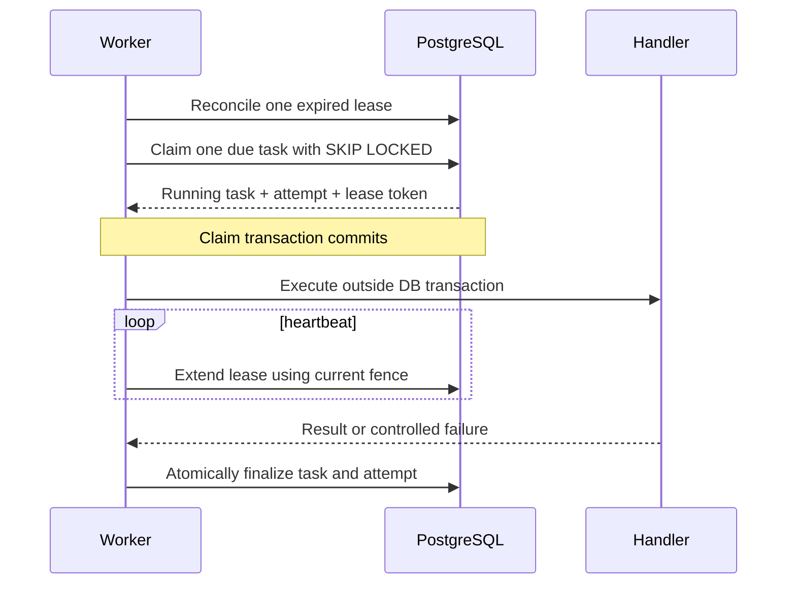

# Architecture Overview

The deployment lab is built in layers. Each milestone introduces one production responsibility and makes it testable before a reasoning model or customer integration is added.

## System shape



The API and worker are separate processes that share typed application code and PostgreSQL state.

- The **API** creates, retrieves, approves, and cancels tasks.
- **PostgreSQL** is the authority for idempotency, lifecycle state, scheduling, execution ownership, and attempt history.
- The **worker** claims approved tasks, runs one handler at a time, heartbeats its lease, and records the outcome.
- **Handlers** receive a narrow typed context. They do not receive a database session or direct state-mutation authority.

## Why PostgreSQL is the coordination layer

The project deliberately avoids Redis, Celery, Kafka, and SQS until the workload proves they are needed.

PostgreSQL already provides the guarantees required for this bounded system:

- durable storage;
- unique constraints;
- transactions;
- row-level locks;
- `ON CONFLICT` handling;
- `FOR UPDATE SKIP LOCKED` task claiming;
- database time for leases and scheduling;
- queryable execution history.

This keeps the operational surface small while supporting multiple API replicas and worker processes.

## Idempotent task creation



The unique database constraint is the final authority. The application does not rely on an in-memory lock or an unsafe check-then-insert sequence.

## Task lifecycle

```text
pending_approval -> approved <---- retry with backoff
        |              |                 ^
        |              v                 |
        |           running -> succeeded |
        |              |  \------------->+
        |              +---------------> failed
        +--------------+---------------> cancelled
```

Only four operations are public:

- create;
- retrieve;
- approve;
- cancel.

Claiming, starting, retrying, succeeding, and failing remain internal worker operations. One domain module owns the transition rules.

## Worker execution



The worker never holds a database transaction open while a handler performs long-running work.

## Lock, lease, and fence

### Row lock

A row lock protects a short claim or transition transaction. It disappears when the transaction commits.

### Lease

A lease is durable, time-limited ownership stored in PostgreSQL. It survives the claim transaction and expires if the worker crashes or loses trusted database ownership.

### Fencing token

Every execution attempt receives a new attempt number and an unguessable token. Only its hash is stored.

Every heartbeat and finalization must match:

- task ID;
- worker ID;
- attempt number;
- lease-token hash;
- current running state;
- unexpired lease.

If an old worker returns after recovery assigned a new execution token, its update affects zero rows and its result is discarded.

## Health and readiness

- `GET /health` asks whether the API process is alive.
- `GET /ready` asks whether the service can reach PostgreSQL and handle database-dependent traffic.

A database outage therefore leaves `/health` at `200` while `/ready` returns `503`. Restarting a healthy API process would not repair the database.

## Migrations

Alembic migrations are an explicit deployment action. Application and worker startup never run migrations automatically.

Current revisions:

- `0001_baseline` — migration foundation;
- `0002_create_tasks` — persistent idempotent task model;
- `0003_reliable_worker_execution` — scheduling, leases, fencing, attempts, retries, and cancellation.

## Observability and privacy

Logs are structured JSON with an allowlist of safe fields.

They may contain request IDs, task IDs, attempt IDs, state changes, safe error codes, and durations. They deliberately exclude task input, results, credentials, idempotency material, lease-token material, authorization headers, SQL parameters, and unsafe exception text.

## Verification

Two independent GitHub Actions jobs validate the system:

1. **Quality and PostgreSQL** — formatting, linting, strict typing, migration round trips, unit tests, concurrency tests, and real PostgreSQL behavior.
2. **Container smoke** — image build, non-root execution, explicit migration, API and worker startup, success, retry, cancellation, readiness degradation, and guaranteed cleanup.

## Next layer

Milestone 4 adds enterprise integrations and safe external actions. That introduces a new problem: task retries are not enough once the worker changes another company’s system. External actions need business-scoped identity, reconciliation, and explicit handling of unknown outcomes.
