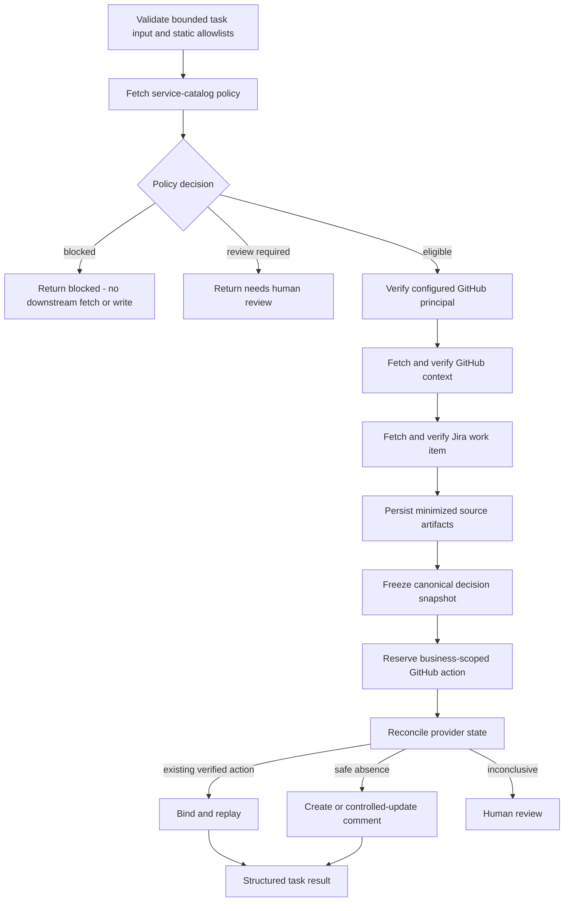

# Enterprise Integration Design

Milestone 4 introduces the first customer-style workflow: a deterministic deployment-context synchronization process across an internal service catalog, GitHub, and Jira.

**Checkpoint 4A is implemented and verified.** Slack remains intentionally outside 4A and is planned as a secondary notification action in Checkpoint 4B.

No LLM is involved yet. The objective is to prove safe enterprise integration before adding reasoning.

## Customer scenario

A software company wants a bounded workflow that:

1. validates a requested service and repository against trusted configuration and the customer’s internal service catalog;
2. reads approved GitHub repository and issue context;
3. reads one named Jira work item;
4. produces a deterministic deployment-context decision;
5. creates, updates, or reconciles one evidence-linked GitHub issue comment when policy allows;
6. preserves minimized source and external-action evidence.

The result is one of:

```text
ready
blocked
needs_human_review
```

A blocked or review result is a successful guardrail outcome, not an execution failure.

## Implemented policy-first workflow



The service catalog is checked before retrieving unnecessary customer data. It is the authority for:

- service identity and aliases;
- owner;
- criticality;
- data classification;
- approved repositories;
- policy version;
- automatic-publication permission;
- automatic-update permission;
- required reviewer.

Authority-bearing catalog records that disagree are not silently merged. They produce `needs_human_review`.

## Authority boundaries

The implemented 4A workflow may:

- read one configured service record;
- verify one configured GitHub principal;
- read one authorized GitHub repository and issue;
- read one explicitly named Jira issue;
- create or update one bounded GitHub comment;
- persist normalized evidence and external-action history.

It may not:

- accept arbitrary provider URLs;
- access unapproved repositories or Jira projects;
- target a GitHub pull request through the issue endpoint;
- modify source code;
- create or merge pull requests;
- deploy software;
- change Jira state;
- post arbitrary caller-supplied content;
- execute shell commands;
- expose credentials or raw customer payloads;
- publish to Slack in Checkpoint 4A.

The workflow is fail-closed in staging and production because inbound authentication and tenancy do not yet exist.

## Resource and principal identity

Configuration requires the intended GitHub principal when the workflow is enabled. Before any write, the connector verifies that the credential resolves to that principal using a documented case-insensitive comparison.

Provider responses are also checked against the request:

- returned GitHub repository must match the requested repository;
- returned GitHub issue number must match the requested issue number;
- the target must be an issue, not a pull request;
- returned Jira key must match the requested Jira key.

A mismatch cannot authorize or render an external action.

## Normalized data

Provider payloads do not flow directly into policy or rendering.

Strict models normalize:

- Jira title, bounded ADF-derived description text, status, priority, labels, assignee ID, source version, and safe source URL;
- GitHub repository identity, numeric repository ID, archive state, default branch, head SHA, issue identity, target kind, and safe URLs;
- service owner, tier, approved repositories, classification, policy version, publication authority, update authority, and reviewer requirement.

Messy source records are handled explicitly:

- aliases;
- inconsistent casing;
- missing optional values;
- duplicate or conflicting service records;
- stale policy;
- malformed candidate records;
- bounded pagination;
- transient provider errors.

## Source provenance

`source_artifacts` stores normalized decision evidence rather than unbounded raw provider responses.

Each artifact records:

- task ID;
- observing attempt ID;
- provider and resource type;
- provider resource ID;
- safe canonical URL without query or fragment;
- source version;
- schema version;
- data classification;
- whether redaction was applied;
- normalized finite JSON;
- content hash and serialized size;
- fetch and retention timestamps.

Changed source content creates a new immutable artifact version. Identical observations replay the existing artifact.

Retention is classification-aware, but automated deletion is not yet implemented and remains an explicit production gap.

## Task attempts versus external actions

`task_attempts` records worker execution.

`external_actions` records intended business side effects in another system.

This distinction is essential because one task may execute several times while one GitHub comment must remain one logical action. A separate task can also target the same business action.

## Business-scoped action identity

The GitHub action key is based on trusted business scope, not task ID:

```text
deployment_context_sync:v1:
{deployment_scope_id}:
{github_repository_id}:
{github_issue_number}:
{service_id}:
github_comment
```

This key is stable across:

- worker retries;
- process restarts;
- replacement tasks that target the same business action.

Task ID and attempt ID remain provenance, not external side-effect identity.

## Decision snapshot

Before reserving a write, the workflow freezes a deterministic decision snapshot from:

- workflow version;
- policy version;
- normalized decision;
- source provider, type, identity, version, and content hash;
- GitHub head version;
- Jira source version.

Semantic source references are sorted before hashing. The same evidence set in a different retrieval order produces the same snapshot; changed, added, or removed evidence changes it.

If evidence changes after action reservation, the workflow does not silently publish a conclusion based on a new evidence set. It requires an explicit action revision or human review.

## External-action lifecycle

A compact action lifecycle distinguishes known success, known failure, and uncertain provider outcome.

```text
reserved -> reconciling -> ready_to_execute -> executing -> succeeded
                       \-> retryable_failure -> reconciling
                       \-> outcome_unknown -> reconciling
                       \-> permanent_failure
                       \-> needs_human_review
```

An append-only action-attempt table records each reservation, lookup, create, update, reconciliation, and state transition.

Every transition remains fenced by the current task lease and updates the action plus exact action-attempt evidence atomically.

## GitHub reconciliation

GitHub is the authoritative external write.

A comment contains a stable hidden marker derived from the action scope:

```html
<!-- ninjatech:deployment-context-sync:v1:<stable-key-hash> -->
```

Reconciliation order:

1. Fetch the exact stored provider comment ID when known.
2. Verify repository, issue, configured author identity, marker, and action scope.
3. If no resource ID exists, scan bounded comment pages for the marker.
4. One match binds or replays the action.
5. Multiple matches require human review.
6. Incomplete pagination prohibits another write.
7. A known comment that was manually deleted or had its marker removed is not silently recreated.

Unconfirmed action references expose a `null` provider resource ID. The implementation never fabricates a placeholder provider identifier.

## Ambiguous write failure

The difficult case is:

1. GitHub accepts the comment.
2. The response is lost, malformed, oversized, or otherwise cannot be trusted.
3. The worker crashes or retries before persisting the provider ID.
4. A replacement worker resumes the task.

The replacement must not blindly create another comment.

It uses:

- stable business action identity;
- `write_started_at`;
- `reconcile_not_before` based on PostgreSQL time;
- provider-ID lookup when available;
- bounded marker search;
- a settlement delay for an in-flight provider action;
- human review when the provider remains inconclusive.

The simulator and container smoke test cover accepted-write-plus-malformed-response and delayed provider acceptance across worker loss. Both paths reconcile to one comment.

This reduces duplicate risk but does not claim mathematical exactly-once behavior across independent systems.

## Cancellation and external truth

Customer cancellation cannot undo a comment that GitHub already confirmed.

The implemented rule is:

- cancellation before a write prevents the write;
- after a valid GitHub response, the external-action success is persisted first;
- customer cancellation is then honored at the task level;
- the task may become `cancelled` while the external-action ledger truthfully remains `succeeded`;
- an ownership-lost worker cannot persist success, and a replacement owner must reconcile the existing provider action.

This keeps business truth separate from local coroutine state.

## HTTP safety

Connectors use a shared bounded async HTTP client with:

- explicit connect, read, write, and pool timeouts;
- TLS verification;
- no implicit environment proxy trust;
- redirects disabled by default;
- configured base URLs only;
- bounded response sizes, pages, and items;
- content-type validation;
- safe correlation headers;
- clean shutdown.

Reads and writes are classified differently:

| Condition | Read | Write |
|---|---|---|
| Connect failure proven before transmission | Retryable | Retryable |
| Read timeout after transmission | Retryable | Outcome unknown |
| 401/403 | Permanent authority error | Permanent authority error |
| 404 | Provider-specific permanent result | Permanent unless contract says otherwise |
| 429 | Bounded retry | Provider-specific proof required before ordinary retry |
| Ambiguous 5xx | Retryable | Reconcile before reissue |
| Malformed or oversized 2xx | Contract failure | Outcome unknown |

A read-only reconciliation failure is retryable; it is not classified as `outcome_unknown` because no new write may have occurred.

## Credential strategy

Sandbox credentials come only from dedicated environment variables or mounted secret files.

Each connector owns access to its credential provider. Secrets never enter task input, source artifacts, logs, API responses, or database error output.

The production upgrade path is:

- GitHub App installation tokens;
- Jira OAuth 2.0;
- customer-managed secret storage;
- tenant-scoped credentials and action keys.

## Checkpoint 4B boundary

Slack has not been implemented in 4A.

Checkpoint 4B will add Slack only as a secondary, non-authoritative action after confirmed GitHub success. Ambiguous notification delivery will not erase the authoritative GitHub outcome and will not be blindly resent.

## Verification

The final Checkpoint 4A head passed:

- Ruff formatting and linting;
- strict mypy;
- Alembic upgrade, downgrade, and re-upgrade through migration `0004_enterprise_integrations`;
- 209 PostgreSQL-backed tests with zero skips;
- non-root container validation;
- API, PostgreSQL, provider simulator, and worker startup;
- successful authoritative workflow;
- independent-task replay without duplicate action;
- ambiguous-write reconciliation;
- blocked policy with zero downstream access;
- delayed provider acceptance across worker restart;
- cancellation after confirmed provider success;
- ownership-loss reconciliation;
- liveness/readiness degradation during database outage;
- guaranteed container and volume cleanup.

## FDE relevance

This milestone demonstrates the work behind a real enterprise deployment:

- discovering the actual workflow;
- identifying systems of record;
- normalizing messy data;
- translating business policy into authority boundaries;
- verifying customer and provider identities;
- handling provider rate limits and failures;
- protecting credentials;
- preventing and reconciling duplicate side effects;
- defining customer-visible acceptance and rollback criteria;
- documenting what remains uncertain.
