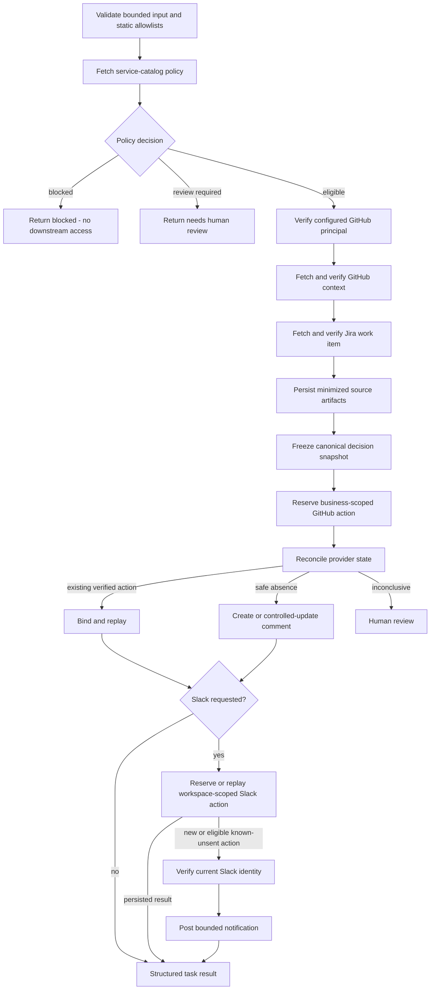

# Enterprise Integration Design

Milestone 4 implements the first customer-style workflow: deterministic deployment-context synchronization across an internal service catalog, GitHub, Jira, and Slack.

**Both Checkpoint 4A and Checkpoint 4B are implemented and verified.** No LLM is involved. The objective is to prove safe enterprise integration and external-side-effect handling before adding reasoning.

## Customer scenario

A software company wants a bounded workflow that:

1. validates a requested service and repository against trusted configuration and the customer’s internal service catalog;
2. reads approved GitHub repository and issue context;
3. reads one named Jira work item;
4. produces a deterministic deployment-context decision;
5. creates, updates, or reconciles one evidence-linked GitHub issue comment when policy allows;
6. optionally sends a secondary Slack notification;
7. preserves minimized source, task-attempt, and external-action evidence.

The business decision is one of:

```text
ready
blocked
needs_human_review
```

A blocked or review result is a successful guardrail outcome, not an execution failure.

## Implemented workflow



The service catalog is checked before retrieving unnecessary customer data. It is the authority for service identity, owner, classification, approved repositories, policy version, automatic publication, automatic update, and reviewer requirements.

Authority-bearing catalog records that disagree are not silently merged. They produce `needs_human_review`.

## Authority boundaries

The workflow may:

- read one configured service record;
- verify configured GitHub and Slack principals;
- read one authorized GitHub repository and issue;
- read one explicitly named Jira issue;
- create or update one bounded GitHub comment;
- post one bounded Slack notification to an allowlisted channel;
- persist normalized evidence and provider-action history.

It may not:

- accept arbitrary provider URLs;
- access unapproved repositories, projects, services, or channels;
- target a GitHub pull request through the issue endpoint;
- modify source code;
- create or merge pull requests;
- deploy software;
- change Jira state;
- post arbitrary caller-supplied text;
- scan Slack history or delete Slack messages;
- execute shell commands;
- expose credentials or raw customer payloads.

The workflow is fail-closed in staging and production because inbound authentication and tenancy do not yet exist.

## Resource and principal identity

Trusted configuration defines the expected GitHub login, Slack workspace ID, Slack bot-user ID, optional Slack bot ID, and channel allowlist.

Before any write:

- the GitHub credential must resolve to the configured principal;
- the Slack credential must resolve to the configured workspace and bot identity;
- returned GitHub repository and issue identities must match the request;
- the GitHub target must be an issue, not a pull request;
- the returned Jira key must match the requested Jira key.

Slack identity verification is cached only while the active credential fingerprint and expected principal values remain unchanged. Credential rotation invalidates the cache. Neither tokens nor fingerprints are logged, persisted, returned, or used as metric labels.

## Normalized data and source provenance

Provider payloads do not flow directly into policy or rendering.

Strict models normalize:

- Jira title, bounded ADF-derived description, status, priority, labels, assignee ID, source version, and safe source URL;
- GitHub repository identity, numeric repository ID, archive state, default branch, head SHA, issue identity, target kind, and safe URLs;
- service owner, tier, repositories, classification, policy version, publication authority, update authority, and reviewer requirement.

`source_artifacts` stores decision-relevant normalized evidence rather than unbounded raw responses. Each artifact records provider identity, resource identity, source version, classification, redaction, finite JSON, content hash, serialized size, and retention timestamp.

Changed source content creates a new immutable artifact version. Identical observations replay the existing artifact. Retention is classification-aware, but automated deletion remains a production gap.

## Task attempts versus external actions

`task_attempts` records worker execution.

`external_actions` records intended business side effects in another system.

This distinction is essential because one task may execute several times while one GitHub comment or Slack notification remains one logical business action. A separately submitted task may target the same action.

## Business-scoped action identity

The GitHub action key is based on trusted business scope, not task ID:

```text
deployment_context_sync:v1:
{deployment_scope_id}:
{github_repository_id}:
{github_issue_number}:
{service_id}:
github_comment
```

The Slack action key is additionally scoped to the verified workspace, channel, and authoritative GitHub revision:

```text
deployment_context_sync:v1:
{deployment_scope_id}:
slack_team:{expected_team_id}:
{github_repository_id}:
{github_issue_number}:
{service_id}:
github_revision:{revision}:
slack_channel:{channel_id}:
notification
```

These identities remain stable across retries, process restarts, and replacement tasks. Task ID and attempt ID remain execution provenance.

## Decision snapshots

Before reserving a provider action, the workflow freezes a deterministic snapshot from the workflow version, policy version, decision, source identities and hashes, provider resource version, and action destination.

Semantic source references are sorted before hashing. Retrieval order therefore does not create false evidence drift. Changed, added, or removed evidence changes the snapshot.

If evidence changes after action reservation, the workflow requires an explicit revision or human review rather than silently publishing a new conclusion under the old authority.

## External-action lifecycle

```text
reserved -> reconciling -> ready_to_execute -> executing -> succeeded
                       \-> retryable_failure
                       \-> outcome_unknown
                       \-> permanent_failure
                       \-> needs_human_review
```

Every transition:

- verifies the current task fence;
- locks the action where needed;
- updates current action state and appends action-attempt evidence atomically;
- uses PostgreSQL time for transition, completion, and not-before timestamps;
- verifies expected row counts.

## Authoritative GitHub reconciliation

GitHub is the authoritative external write.

The comment contains a stable hidden marker derived from the business action scope. Reconciliation proceeds in this order:

1. fetch the exact stored provider comment ID when known;
2. verify repository, issue, configured author, and marker;
3. otherwise scan bounded comment pages for the marker;
4. bind one verified match;
5. stop for human review on multiple matches, incomplete pagination, deletion, marker removal, or inconclusive provider state.

An exact safe action-link sanitizer preserves a bounded `#issuecomment-...` anchor while removing credentials and query parameters. Source-artifact URL canonicalization remains stricter and removes fragments.

## Ambiguous GitHub write

If GitHub may have accepted a write but the response cannot be trusted, the action becomes `outcome_unknown`. A replacement worker waits for the PostgreSQL-based reconciliation holdoff, then reconciles by provider ID or marker before considering another write.

The simulator covers malformed successful responses and delayed acceptance across worker loss. These paths reconcile to one comment without claiming mathematical exactly-once behavior.

## Secondary Slack delivery

Slack runs only after confirmed authoritative GitHub success.

The message is deterministic, bounded, and contains only the decision, canonical service ID, exact authoritative GitHub comment link, and GitHub action revision. It disables link and media unfurling and uses no message metadata.

Delivery is ledger-first:

- existing `succeeded`, `outcome_unknown`, permanent-failure, and review states replay without contacting Slack;
- unresolved `executing` state becomes fenced `outcome_unknown` rather than triggering another post;
- only a new or eligible known-unsent action performs current Slack identity verification and a bounded `chat.postMessage` request.

Known-unsent failures may use a provider `Retry-After` or a small default not-before delay. Immediate replay performs no Slack call. After the database-authoritative delay expires, a later task may retry the same action.

An ambiguous Slack write is intentionally never resent automatically because Checkpoint 4B does not request Slack history access. It remains a degraded, manually reconciled notification state. GitHub truth remains valid.

## Cancellation and ownership

Customer cancellation cannot undo a provider effect already accepted.

Implemented rules:

- cancellation before a write prevents it;
- after a confirmed provider response, external-action success is persisted first;
- customer cancellation is then honored at the task level;
- an ownership-lost worker cannot persist success or mutate action history;
- replacement owners reconcile GitHub and preserve Slack unknown outcomes without blind resend.

## HTTP safety

Connectors use a shared bounded async HTTP client with explicit timeouts, TLS verification, disabled implicit proxy trust, disabled redirects, configured base URLs only, bounded responses and pagination, content-type validation, and clean shutdown.

Reads and writes are classified differently. Reads can normally retry after transient failure. A write that may have been transmitted requires reconciliation or an explicit unknown-outcome state.

## Metrics

Metrics are typed, process-local, and emitted through allowlisted structured records. Allowed labels are low-cardinality enums such as provider, operation, outcome class, policy decision, action status, and Slack delivery state.

Task IDs, repositories, services, issue numbers, channels, URLs, provider IDs, and error messages are prohibited as metric labels. Counters reset after process restart; no production metrics backend or public metrics endpoint exists yet.

## Customer deployment package

The repository includes a fictional Northstar Payments package covering:

- discovery notes;
- workflow contract;
- integration and data map;
- security and permissions;
- acceptance criteria;
- rollout and rollback plan.

The security document explicitly lists authentication, SSO/SCIM, tenant isolation, production data residency, managed secrets, automated retention deletion, and compliance certification as not implemented.

## Verification

The final Milestone 4B head passed:

- Ruff formatting and linting;
- strict mypy;
- Alembic upgrade, downgrade, and re-upgrade through migration `0004_enterprise_integrations`;
- 274 PostgreSQL-backed tests, with opt-in real-provider sandbox tests excluded;
- non-root container validation;
- GitHub and Slack success;
- independent-task replay without duplicate actions;
- GitHub ambiguous-write reconciliation;
- Slack unknown-outcome no-resend;
- permanent Slack degradation without loss of GitHub truth;
- policy-blocked zero provider access;
- credential-rotation identity checks;
- workspace-scoped action identity;
- Retry-After not-before handling;
- exact GitHub comment links;
- cancellation and ownership-loss races;
- database-outage readiness degradation;
- guaranteed cleanup.

## FDE relevance

This milestone demonstrates the work behind a real enterprise deployment:

- discover the actual workflow and systems of record;
- normalize messy customer data;
- translate policy into permissions and stopping conditions;
- verify provider and resource identities;
- protect credentials;
- distinguish authoritative from secondary outcomes;
- handle rate limits, ambiguity, retries, cancellation, and ownership loss;
- prevent duplicate business effects;
- define customer-visible acceptance, security, rollout, and rollback criteria;
- state limitations honestly.
