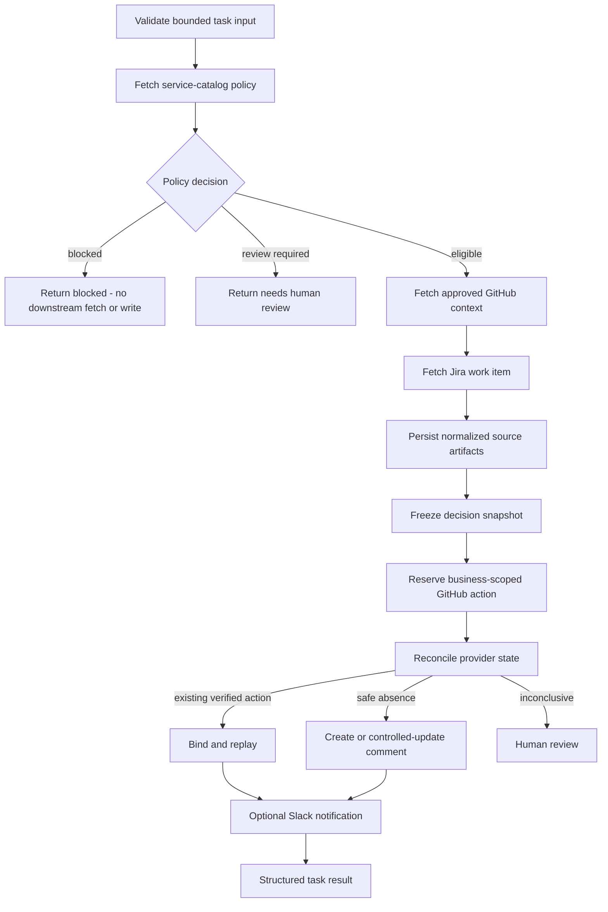

# Enterprise Integration Design

Milestone 4 introduces the first customer-style workflow: a deterministic deployment-context synchronization process across Jira, GitHub, an internal service catalog, and Slack.

No LLM is involved yet. The objective is to prove safe enterprise integration before adding reasoning.

## Customer scenario

A software company wants a bounded workflow that:

1. reads a named Jira issue;
2. validates the target service and repository against the customer’s internal service catalog;
3. reads approved GitHub repository and issue context;
4. produces a deterministic deployment-context decision;
5. creates or updates one evidence-linked GitHub issue comment when policy allows;
6. optionally sends a secondary Slack notification;
7. preserves source and action evidence.

The result is one of:

```text
ready
blocked
needs_human_review
```

A blocked or review result is a successful guardrail outcome, not an execution failure.

## Policy-first workflow



The service catalog is checked before retrieving unnecessary customer data. It is the authority for:

- service identity and aliases;
- owner;
- criticality;
- data classification;
- approved repositories;
- policy version;
- automatic-publication permission;
- required reviewer.

## Authority boundaries

The workflow may:

- read one configured service record;
- read one explicitly named Jira issue;
- read one approved GitHub repository and issue;
- create or update one bounded GitHub comment;
- send one bounded Slack notification;
- persist normalized evidence and action history.

It may not:

- accept arbitrary provider URLs;
- access unapproved repositories;
- modify source code;
- create or merge pull requests;
- deploy software;
- change Jira state;
- post arbitrary caller-supplied content;
- execute shell commands;
- expose credentials or raw customer payloads;
- treat Slack as the system of record.

## Normalized data

Provider payloads do not flow directly into policy or rendering.

Strict models normalize:

- Jira title, description, status, priority, labels, assignee ID, version, and source reference;
- GitHub repository identity, archive state, default branch, head SHA, issue identity, and safe URLs;
- service owner, tier, approved repositories, classification, policy version, and publication authority.

Messy source records are handled explicitly:

- aliases;
- inconsistent casing;
- missing optional values;
- duplicate or conflicting service records;
- stale policy;
- malformed candidate records;
- bounded pagination;
- transient provider errors.

Conflicting records are not silently merged. They produce `needs_human_review`.

## Source provenance

`source_artifacts` stores normalized decision evidence rather than unbounded raw provider responses.

Each artifact records:

- task ID;
- observing attempt ID;
- provider and resource type;
- provider resource ID;
- safe canonical URL;
- source version;
- schema version;
- data classification;
- whether redaction was applied;
- normalized finite JSON;
- content hash and serialized size;
- fetch and retention timestamps.

Changed source content creates a new immutable artifact version. Identical observations replay the existing artifact.

## Task attempts versus external actions

`task_attempts` records worker execution.

`external_actions` records intended business side effects in another system.

This distinction is essential because one task may execute several times while one GitHub comment must remain one logical action.

## Business-scoped action identity

The GitHub action key is based on trusted business scope, not only task ID:

```text
deployment_context_sync:v1:
{deployment_scope_id}:
{github_repository_id}:
{github_issue_number}:
{service_id}:
github_comment
```

This key is stable across:

- worker retries;
- process restarts;
- replacement tasks that target the same business action.

Task ID and attempt ID remain provenance, not external side-effect identity.

## Decision snapshot

Before reserving a write, the workflow freezes a deterministic decision snapshot from:

- workflow version;
- policy version;
- normalized decision;
- source artifact IDs and hashes;
- GitHub head SHA;
- Jira source version.

If the evidence changes after action reservation, the workflow does not silently publish a conclusion based on a new evidence set. It requires an explicit action revision or human review.

## External-action lifecycle

A compact action lifecycle distinguishes known success, known failure, and uncertain provider outcome.

```text
reserved -> reconciling -> executing -> succeeded
                      \-> outcome_unknown -> reconciling
                      \-> retryable_failure -> reconciling
                      \-> permanent_failure
```

An append-only action-attempt table records each lookup, create, update, or reconciliation attempt.

Every transition remains fenced by the current task lease.

## GitHub reconciliation

GitHub is the authoritative external write.

A comment contains a stable hidden marker derived from the action scope:

```html
<!-- ninjatech:deployment-context-sync:v1:<stable-key-hash> -->
```

Reconciliation order:

1. Fetch the exact stored provider comment ID when known.
2. Verify repository, issue, author identity, marker, and action scope.
3. If no resource ID exists, scan bounded comment pages for the marker.
4. One match binds or replays the action.
5. Multiple matches require human review.
6. Incomplete pagination prohibits another write.
7. A known comment that was manually deleted or had its marker removed is not silently recreated.

## Ambiguous write failure

The difficult case is:

1. GitHub accepts the comment.
2. The response is lost.
3. The worker crashes before persisting the provider ID.
4. A replacement worker retries the task.

The replacement must not blindly create another comment.

It uses:

- stable action identity;
- `write_started_at`;
- `reconcile_not_before`;
- provider-ID lookup when available;
- bounded marker search;
- a settlement delay for an in-flight provider action;
- human review when the provider remains inconclusive.

This reduces duplicate risk but does not claim mathematical exactly-once behavior across independent systems.

## Slack semantics

Slack is secondary and runs only after authoritative GitHub success.

The notification contains:

- task identifier;
- decision;
- link to the GitHub comment;
- no full source data;
- no credentials;
- no sensitive metadata.

An ambiguous Slack delivery is not blindly resent. The task may complete with a degraded notification state because GitHub remains authoritative.

## HTTP safety

Connectors use a shared bounded async HTTP client with:

- explicit connect, read, write, and pool timeouts;
- TLS verification;
- no implicit environment proxy trust;
- redirects disabled by default;
- configured base URLs only;
- bounded response sizes, pages, and items;
- content-type validation;
- safe correlation headers;
- clean shutdown.

Reads and writes are classified differently:

| Condition | Read | Write |
|---|---|---|
| Connect failure proven before transmission | Retryable | Retryable |
| Read timeout after transmission | Retryable | Outcome unknown |
| 401/403 | Permanent authority error | Permanent authority error |
| 404 | Provider-specific permanent result | Permanent unless contract says otherwise |
| 429 | Bounded retry | Provider-specific proof required before ordinary retry |
| Ambiguous 5xx | Retryable | Reconcile before reissue |
| Malformed or oversized 2xx | Contract failure | Outcome unknown |

## Credential strategy

Sandbox credentials come only from dedicated environment variables or mounted secret files.

Each connector owns access to its credential provider. Secrets never enter task input, source artifacts, logs, API responses, or database error output.

The production upgrade path is:

- GitHub App installation tokens;
- Jira OAuth 2.0;
- customer-managed secret storage;
- tenant-scoped credentials and action keys.

Because the task API is not yet authenticated, this workflow is hard-disabled in staging and production. It may run only in explicit development, test, or controlled demo environments until authentication and tenancy are added.

## FDE relevance

This milestone demonstrates the work behind a real enterprise deployment:

- discovering the actual workflow;
- identifying systems of record;
- normalizing messy data;
- translating business policy into authority boundaries;
- handling provider rate limits and failures;
- protecting credentials;
- preventing duplicate side effects;
- defining customer-visible acceptance and rollback criteria;
- documenting what remains uncertain.
