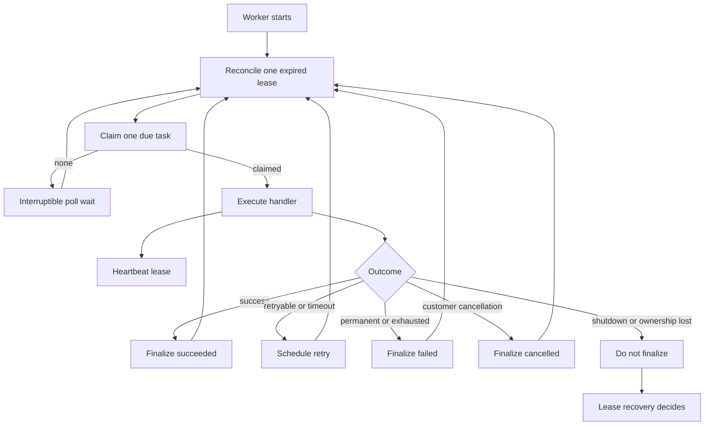

# Reliable Worker Execution

Milestone 3 turns an approved task into durable, recoverable execution.

The goal is not to promise exactly-once execution. The goal is to make ownership explicit, preserve every attempt, prevent stale workers from committing, and recover safely after crashes.

## Worker lifecycle



Each worker process handles one task at a time. Horizontal concurrency comes from multiple worker processes rather than an internal thread or coroutine pool.

## Claiming

The claim query selects one supported, due task:

```sql
SELECT *
FROM tasks
WHERE status = 'approved'
  AND available_at <= clock_timestamp()
  AND attempt_count < max_attempts
  AND task_type IN (...)
ORDER BY available_at, created_at, id
FOR UPDATE SKIP LOCKED
LIMIT 1;
```

Inside the same short transaction, the worker:

1. moves the task to `running`;
2. assigns the worker identity;
3. generates a fresh execution token and stores only its SHA-256 hash;
4. sets heartbeat and lease timestamps;
5. increments the attempt number;
6. inserts a durable `task_attempts` row;
7. commits.

Only after commit does handler execution begin.

This means a crash immediately after claim still leaves a recoverable running attempt.

## Why `SKIP LOCKED`

Without `SKIP LOCKED`, multiple workers may block behind the same first eligible task.

With it, each worker skips rows already being claimed and can select different work. PostgreSQL remains the arbitration point, so two workers cannot successfully claim the same task attempt.

## Heartbeats

A heartbeat is a short transaction that extends the lease only when the worker still owns the current execution.

It must match:

- task ID;
- worker ID;
- attempt number;
- token hash;
- running status;
- unexpired lease.

The matching attempt row is updated atomically with the task row.

Successful heartbeats are DEBUG-level events to avoid noisy production logs.

## Ownership loss

If a heartbeat cannot confirm ownership because of a database error, expired lease, token mismatch, or recovery race, the worker stops trusting itself.

It then:

1. marks local ownership as lost;
2. requests cancellation of the handler coroutine;
3. stops initiating new external work;
4. refuses to persist success, failure, retry, or cancellation;
5. discards any late result;
6. stops claiming further tasks.

This is intentionally conservative. Uncertain ownership is treated as lost ownership.

## Lease recovery

Before claiming new work, each worker may reconcile one expired running task:

```sql
SELECT *
FROM tasks
WHERE status = 'running'
  AND lease_expires_at <= clock_timestamp()
ORDER BY lease_expires_at, id
FOR UPDATE SKIP LOCKED
LIMIT 1;
```

The recovery transaction:

- closes the exact previous attempt as `lease_expired`;
- preserves its evidence;
- finalizes a pending customer cancellation;
- fails the task if attempts are exhausted;
- otherwise returns it to `approved` with future availability;
- clears active worker and lease fields.

A later claim receives a new attempt number and token.

## Fencing

The attempt number and token form a fencing identity.

Example:

1. Worker A owns attempt 1 with token A.
2. Worker A becomes unavailable.
3. Its lease expires.
4. Recovery closes attempt 1.
5. Worker B claims attempt 2 with token B.
6. Worker A returns and reports success.
7. The update fails because attempt 1 and token A are no longer current.
8. Worker A discards its result.

Fencing prevents stale database updates. It cannot undo an external side effect that was already accepted elsewhere.

## Retry policy

Retryable failures use bounded exponential equal jitter:

```text
ceiling = min(cap, base × 2^(attempt_number - 1))
delay   = ceiling/2 + random(0, 1) × ceiling/2
```

This avoids immediate retry storms while keeping delays bounded.

The worker distinguishes:

| Outcome | Persisted behavior |
|---|---|
| Retryable error | Return to `approved` with future `available_at` |
| Permanent error | `failed` immediately |
| Timeout | Retry or fail according to attempt limit |
| Unexpected exception | Sanitized retry or failure policy |
| Customer cancellation | `cancelled` |
| Ownership loss | No finalization |
| Shutdown grace expiry | No finalization |

## Cancellation

Cancellation is cooperative.

- `pending_approval` or `approved` tasks cancel immediately.
- A running task receives `cancellation_requested_at` and the API returns `202`.
- The worker observes the request, cancels the local handler, and finalizes `cancelled` if it still owns the fence.
- If the worker crashes, lease recovery finalizes the cancellation without restarting business work.

A blocking third-party library may not respond immediately to coroutine cancellation. Future connectors therefore require bounded I/O timeouts.

## Graceful shutdown

On `SIGTERM` or `SIGINT`, the worker:

- stops claiming new work;
- continues heartbeating the active task;
- allows a configurable grace period;
- finalizes normally if the handler finishes;
- otherwise cancels the local coroutine, stops heartbeating, and records no false outcome.

The lease expires and recovery decides what happens next.

## Attempt history

`task_attempts` is append-only execution evidence. Each row records:

- task and attempt identifiers;
- worker identity;
- token hash;
- started and heartbeat timestamps;
- terminal status and reason;
- sanitized error code and summary.

Previous attempts are never overwritten.

The final structured result belongs only on the task row, avoiding two authoritative result copies.

## At-least-once semantics

The system is intentionally at least once.

A crash can occur after an external system accepted an action but before the task recorded success. Re-execution may therefore repeat an external side effect unless the integration has its own stable action key and reconciliation logic.

Milestone 4 addresses that boundary explicitly.
